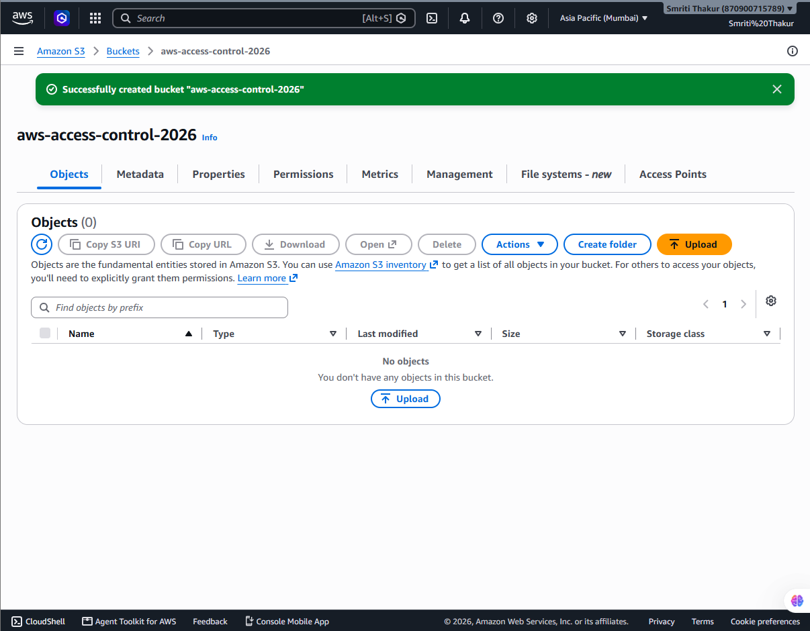
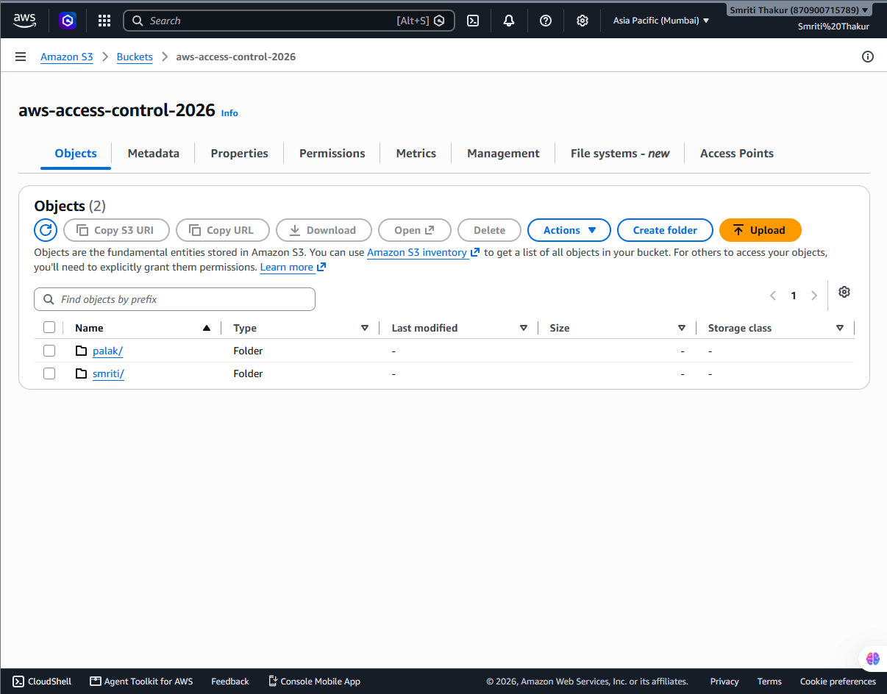
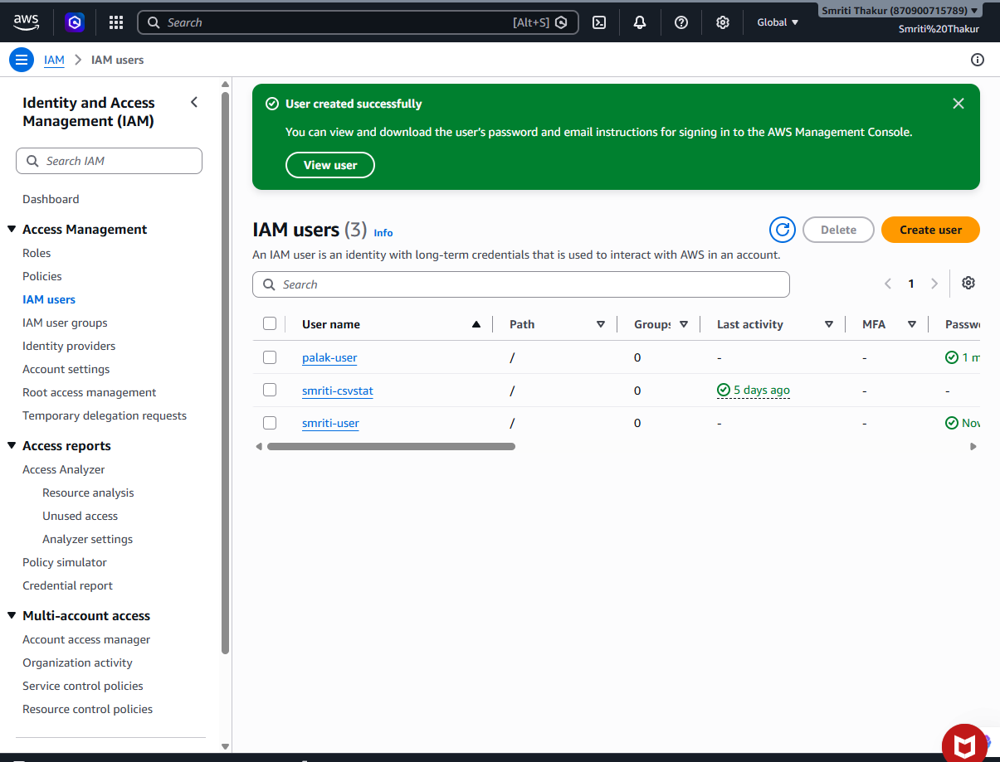
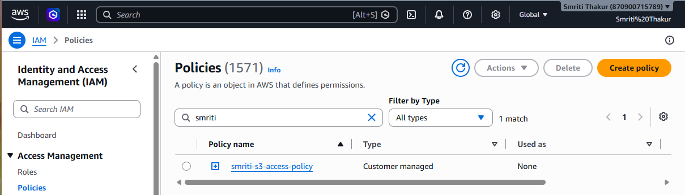
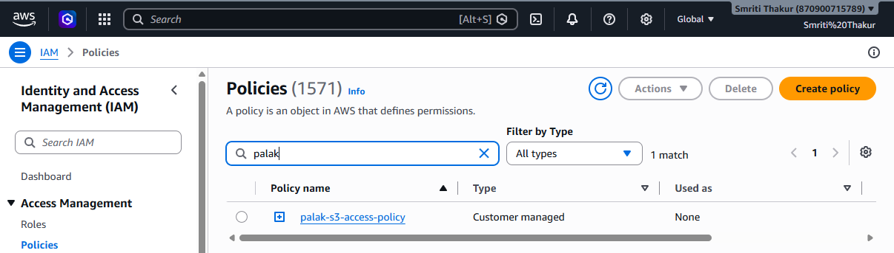
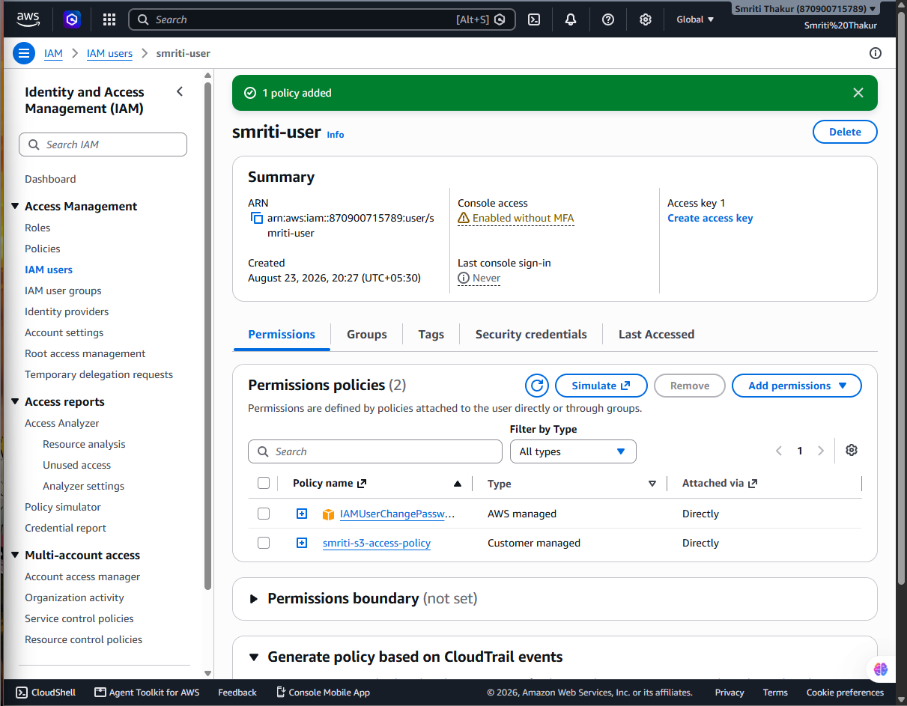
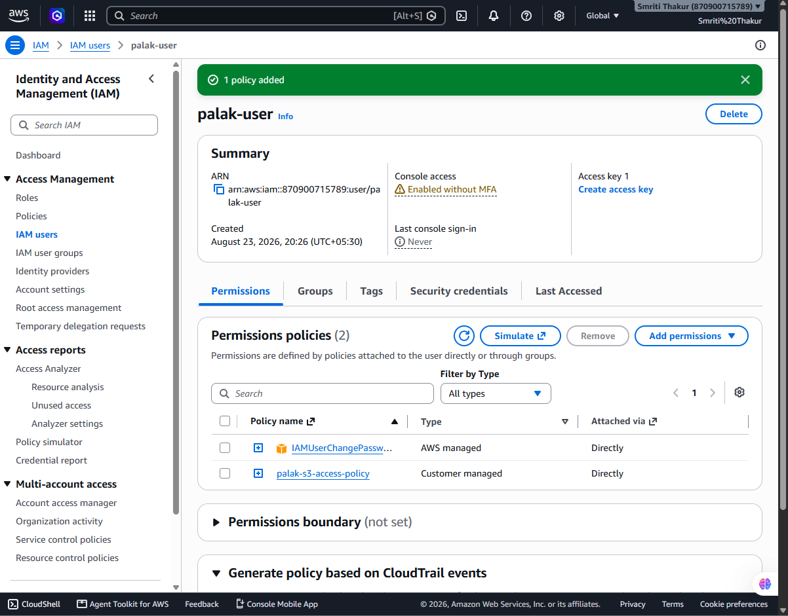
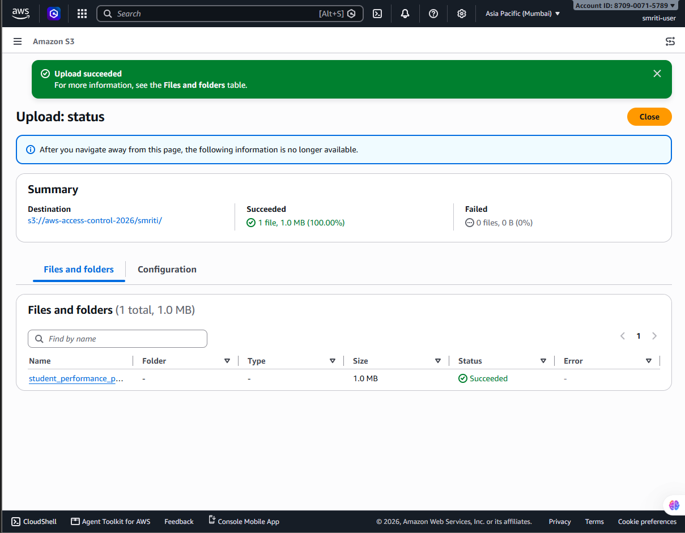
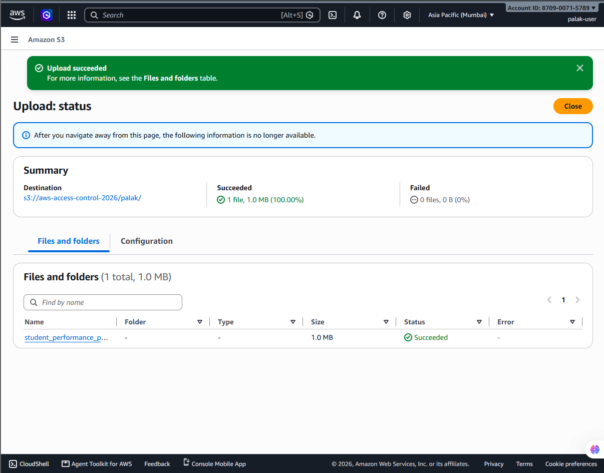
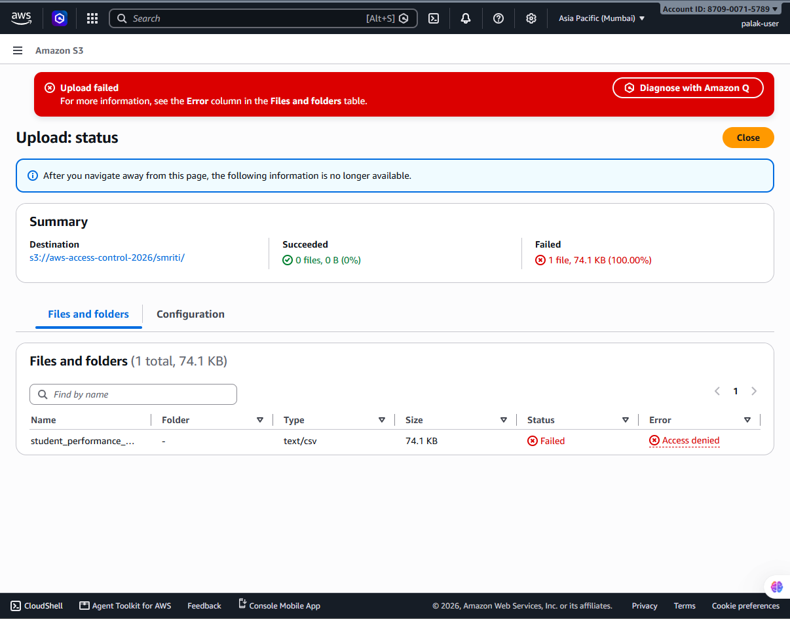

# AWS S3 Access Control Project

## Project Overview

This project demonstrates implementing **user-based access control in Amazon S3 using IAM policies**.

Two IAM users were created:

- **smriti-user**
- **palak-user**

The objective was to configure permissions such that:

| User | Own Folder Access | Other User Folder Access |
|------|-------------------|--------------------------|
| Smriti | Read + Write | Read Only |
| Palak | Read + Write | Read Only |

---

# Implementation Steps

## 1. Create S3 Bucket

Created an S3 bucket named:

`aws-access-control-2026`

The bucket contains separate folders for each user:

- `smriti/`
- `palak/`



---

## 2. Create Folder Structure in S3

Created user-specific folders inside the bucket:

- Smriti folder
- Palak folder



---

## 3. Create IAM Users

Created two IAM users:

- `smriti-user`
- `palak-user`



---

# IAM Policies Configuration

## 4. Smriti User Policy

Created a custom IAM policy for Smriti.

Permissions:

- Read + Write access to `smriti/`
- Read-only access to `palak/`



---

## 5. Palak User Policy

Created a custom IAM policy for Palak.

Permissions:

- Read + Write access to `palak/`
- Read-only access to `smriti/`



---

# Permission Verification

## 6. Smriti User Permissions

Verified Smriti user's folder-level permissions.



---

## 7. Palak User Permissions

Verified Palak user's folder-level permissions.



---

# Access Testing

## 8. Smriti Upload Success

Smriti user successfully uploaded a file inside their own folder.



---

## 9. Smriti Access Denied

Smriti user was denied write access while uploading to Palak's folder.


---

## 10. Palak Upload Success

Palak user successfully uploaded a file inside their own folder.



---

## 11. Final Access Denied Validation

Unauthorized write access was blocked successfully.



---

# Final Access Control Verification

All permissions were tested successfully:

- Own folder → Read + Write
- Other user's folder → Read Only
- Unauthorized uploads → Access Denied

---

# Architecture Overview

The project follows an AWS IAM-based access control architecture.

```
IAM Users
    |
    |
IAM Policies
    |
    |
Amazon S3 Bucket
    |
    ├── smriti/
    |
    └── palak/
```

Each IAM user is assigned a custom policy that defines folder-level permissions inside the S3 bucket.

---

# AWS Services Used

| Service | Purpose |
|---------|---------|
| Amazon S3 | Secure object storage |
| AWS IAM | User authentication and authorization |
| IAM Policies | Define user permissions |
| AWS Management Console | Resource creation and testing |

---

# Permission Matrix

| User | Resource | Permissions |
|------|----------|-------------|
| smriti-user | smriti/* | Read, Write |
| smriti-user | palak/* | Read Only |
| palak-user | palak/* | Read, Write |
| palak-user | smriti/* | Read Only |

---

# Testing Results

The configured permissions were validated using IAM user accounts.

| Test Case | Expected Result | Status |
|-----------|----------------|--------|
| Smriti uploads file to smriti/ folder | Upload allowed | Passed |
| Smriti uploads file to palak/ folder | Access Denied | Passed |
| Palak uploads file to palak/ folder | Upload allowed | Passed |
| Palak uploads file to smriti/ folder | Access Denied | Passed |
| Smriti reads files from palak/ folder | Read allowed | Passed |
| Palak reads files from smriti/ folder | Read allowed | Passed |

---

# Requirements

This project does not require any external programming dependencies.

Requirements:

- AWS Account
- Amazon S3
- AWS IAM
- AWS Management Console

## requirements.txt

```
# No external dependencies required
```

---

# Project Structure

```
aws-s3-access-control/

│
├── screenshots/
│
│   ├── 01_bucket_creation.png
│   ├── 02_s3_folders.png
│   ├── 03_iam_users.png
│   ├── 04_smriti_policy.png
│   ├── 05_palak_policy.png
│   ├── 06_smriti_permissions.png
│   ├── 07_palak_permissions.png
│   ├── 08_smriti_upload_success.png
│   ├── 09_smriti_access_denied.png
│   ├── 10_palak_upload_success.png
│   └── 11_smriti_access_denied.png
│
├── requirements.txt
├── README.md
└── LICENSE
```

---

# Conclusion

Successfully implemented secure folder-level access control in Amazon S3 using IAM users and custom IAM policies.

The final configuration allows users to collaborate securely while maintaining data protection through restricted permissions and least privilege access.# AWS S3 Access Control Project

## Project Overview

This project demonstrates implementing **user-based access control in Amazon S3 using IAM policies**.

Two IAM users were created:

- **smriti-user**
- **palak-user**

The objective was to configure permissions such that:

| User | Own Folder Access | Other User Folder Access |
|------|-------------------|--------------------------|
| Smriti | Read + Write | Read Only |
| Palak | Read + Write | Read Only |

---

# Implementation Steps

## 1. Create S3 Bucket

Created an S3 bucket named:

`aws-access-control-2026`

The bucket contains separate folders for each user:

- `smriti/`
- `palak/`


---

## 2. Create Folder Structure in S3

Created user-specific folders inside the bucket:

- Smriti folder
- Palak folder


---

## 3. Create IAM Users

Created two IAM users:

- `smriti-user`
- `palak-user`


---

# IAM Policies Configuration

## 4. Smriti User Policy

Created a custom IAM policy for Smriti.

Permissions:

- Read + Write access to `smriti/`
- Read-only access to `palak/`


---

## 5. Palak User Policy

Created a custom IAM policy for Palak.

Permissions:

- Read + Write access to `palak/`
- Read-only access to `smriti/`


---

# Permission Verification

## 6. Smriti User Permissions

Verified Smriti user's folder-level permissions.


---

## 7. Palak User Permissions

Verified Palak user's folder-level permissions.


---

# Access Testing

## 8. Smriti Upload Success

Smriti user successfully uploaded a file inside their own folder.


---

## 9. Smriti Access Denied

Smriti user was denied write access while uploading to Palak's folder.


---

## 10. Palak Upload Success

Palak user successfully uploaded a file inside their own folder.


---

## 11. Final Access Denied Validation

Unauthorized write access was blocked successfully.


---

# Final Access Control Verification

All permissions were tested successfully:

- Own folder → Read + Write
- Other user's folder → Read Only
- Unauthorized uploads → Access Denied

---

# Architecture Overview

The project follows an AWS IAM-based access control architecture.

```
IAM Users
    |
    |
IAM Policies
    |
    |
Amazon S3 Bucket
    |
    ├── smriti/
    |
    └── palak/
```

Each IAM user is assigned a custom policy that defines folder-level permissions inside the S3 bucket.

---

# AWS Services Used

| Service | Purpose |
|---------|---------|
| Amazon S3 | Secure object storage |
| AWS IAM | User authentication and authorization |
| IAM Policies | Define user permissions |
| AWS Management Console | Resource creation and testing |

---

# Permission Matrix

| User | Resource | Permissions |
|------|----------|-------------|
| smriti-user | smriti/* | Read, Write, Delete |
| smriti-user | palak/* | Read Only |
| palak-user | palak/* | Read, Write, Delete |
| palak-user | smriti/* | Read Only |

---

# Security Implementation

The project follows the principle of **Least Privilege Access**.

Security controls implemented:

- Blocked public access on S3 bucket
- IAM-based authentication
- Customer-managed IAM policies
- Folder-level object permissions
- Restricted unauthorized write operations
- Controlled user-based access to shared storage

---

# Testing Results

The configured permissions were validated using IAM user accounts.

| Test Case | Expected Result | Status |
|-----------|----------------|--------|
| Smriti uploads file to smriti/ folder | Upload allowed | Passed |
| Smriti uploads file to palak/ folder | Access Denied | Passed |
| Palak uploads file to palak/ folder | Upload allowed | Passed |
| Palak uploads file to smriti/ folder | Access Denied | Passed |
| Smriti reads files from palak/ folder | Read allowed | Passed |
| Palak reads files from smriti/ folder | Read allowed | Passed |

---

# Requirements

This project does not require any external programming dependencies.

Requirements:

- AWS Account
- Amazon S3
- AWS IAM
- AWS Management Console

## requirements.txt

```
# No external dependencies required
```

---

# Project Structure

```
aws-s3-access-control/

│
├── screenshots/
│
│   ├── 01_bucket_creation.png
│   ├── 02_s3_folders.png
│   ├── 03_iam_users.png
│   ├── 04_smriti_policy.png
│   ├── 05_palak_policy.png
│   ├── 06_smriti_permissions.png
│   ├── 07_palak_permissions.png
│   ├── 08_smriti_upload_success.png
│   ├── 09_smriti_access_denied.png
│   ├── 10_palak_upload_success.png
│   └── 11_smriti_access_denied.png
│
├── requirements.txt
├── README.md
└── LICENSE
```

---

# Conclusion

Successfully implemented secure folder-level access control in Amazon S3 using IAM users and custom IAM policies.

The final configuration allows users to collaborate securely while maintaining data protection through restricted permissions and least privilege access.